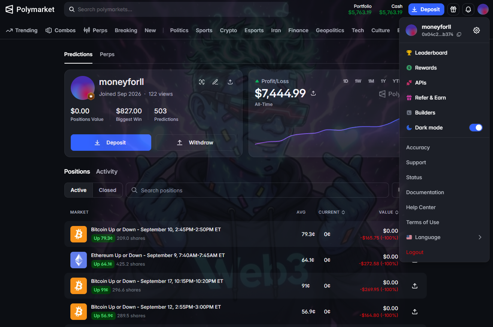
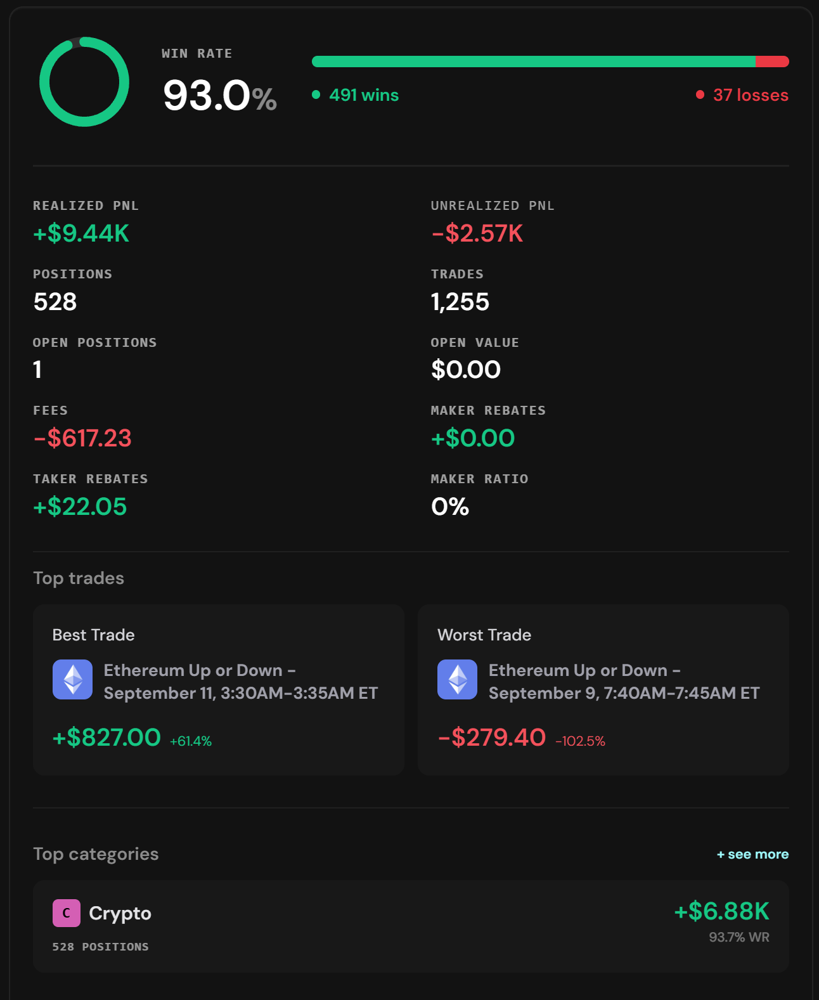
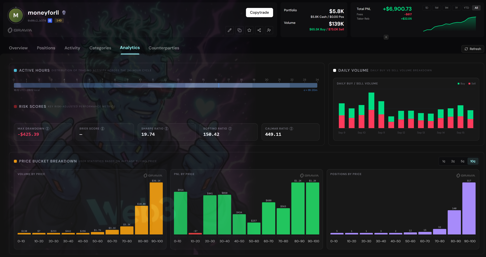
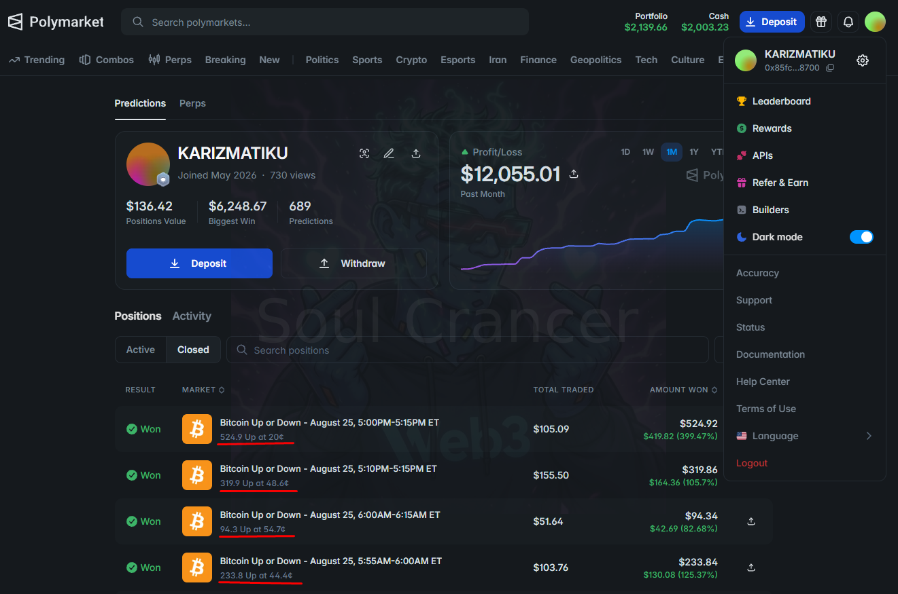
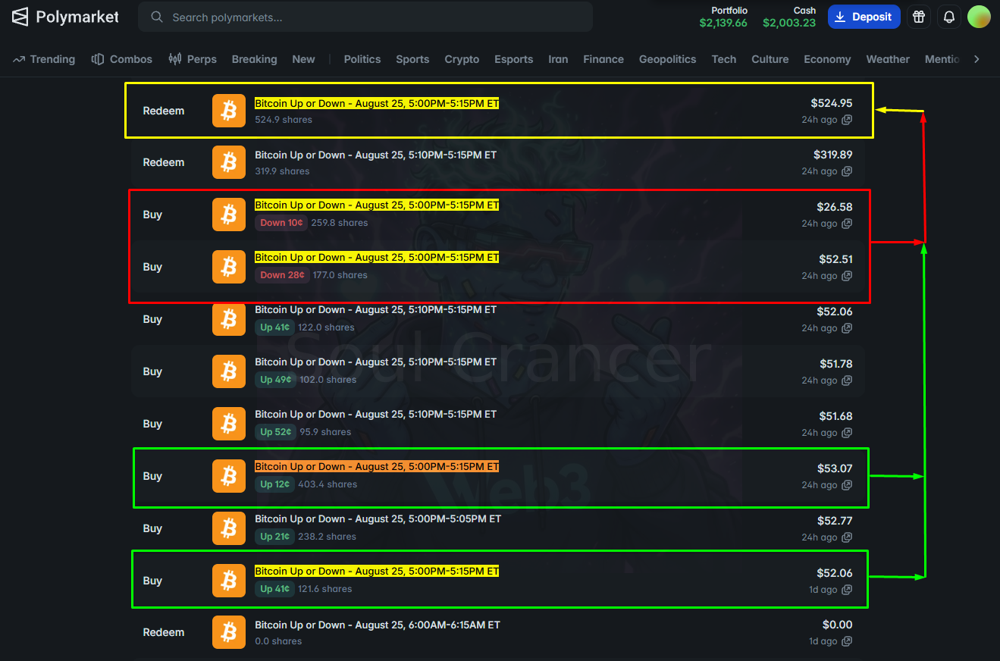

# Polymarket Trading Strategies

Systematic strategies running on the current **TWAP edition**. This document is a research journal: market condition, signal, entry, execution, edge, and risk — not a software manual.

`Polymarket` · `Algorithmic Trading` · `Quantitative Strategies` · `TWAP Edition`

Questions or support:

---

## Strategy Philosophy

Polymarket is not only about predicting the outcome. Short-window markets have **microstructure**: liquidity, timing, order-book lag, and brief dislocations around shocks and cycle boundaries.

These strategies trade **observable market behavior**, not a narrative view on Bitcoin. A condition has to be present in price, book, and remaining time before size is taken.

---

## Strategy Overview

| Strategy | Core Idea | Market Condition | Status |
| --- | --- | --- | --- |
| TWAP-Aware EndCycle Sniper | Buy the late-cycle favorite along its time-weighted path while it still trades below $1 | Short-window market near expiry; one side dominating | Popular — Available for Sale |
| Momentum Spike Sniping / Arbitrage | Hit a sudden dislocation after a sharp expansion | Fast repricing in a short BTC Up/Down window | Live |
| Additional strategies | Documented as they are introduced | — | Planned |

Live profiles are linked in each section. Displayed account figures are UI snapshots, not a verified track record.

---

## TWAP-Aware Polymarket EndCycle Sniper (Popular — Available for Sale)

Polymarket profile: [moneyforll](https://polymarket.com/@moneyforll?tab=activity)

### The Idea

In short-cycle Up or Down markets, uncertainty compresses as the clock runs out. One side becomes the favorite while the book can still quote it below $1.

This version is **TWAP-aware**. The favorite is a path through the window, and the decision uses the time-weighted price of that path: where the side has traded, where it is offered now, and how much time is left. Size is taken in clips while the average entry still sits inside the gap to settlement.

The trade is late-cycle execution. If the path has already closed on $1, or the book cannot fill the average the clock allows, there is no trade.

### How the Trade Works

1. Monitor the active short-cycle market as it approaches the end of its window.
2. Read which outcome is dominating, the path that side has printed, and how much size is on the book.
3. Compare the time-weighted price of the favorite with the live quote and the time remaining.
4. Lift the favored side in clips while that average still clears the remaining gap.
5. Hold through resolution and redeem if the market settles in-the-money.

### Visual Example

  
  

**Example:** Polymarket profile [moneyforll](https://polymarket.com/@moneyforll?tab=activity), with the performance panel beside it.

- Profile profit/loss reads **$7,444.99**. The curve is the account’s displayed path. **503** predictions, biggest win **$827.00**, positions value **$0.00**. Joined Sep 2026, **122** views on this snapshot.
- Win rate **93.0%**: **491** wins and **37** losses, on **528** positions and **1,255** trades.
- Realized PnL **+$9.44K**, unrealized PnL **-$2.57K**, open positions **1**, open value **$0.00**. This panel is a separate display from the Polymarket all-time figure.
- Fees **-$617.23**, taker rebates **+$22.05**, maker rebates **$0.00**, maker ratio **0%**. The account takes liquidity.
- Best trade on the panel: **Ethereum Up or Down — September 11, 3:30AM–3:35AM ET**, **+$827.00** (**+614%**). A gain of that size is a low entry that settled at $1. A fill in the 90¢ band redeems closer to an 11% gap.
- Worst trade on the panel: **Ethereum Up or Down — September 9, 7:40AM–7:45AM ET**, **-$279.40** (**-102.5%**). The favorite-side read can still finish at zero on a 5-minute window.

  

**Example:** Price buckets, active hours, and risk scores for the same account.

- Positions concentrate in the favorite band: **251** in **90–100¢** and **143** in **80–90¢**.
- Volume has the same shape. The **90–100¢** bucket is the bulk of traded size.
- PnL is green across nearly every decile, with the larger bars in the upper price buckets. Displayed profit is many small gaps to $1, repeated. The **+614%** line is a separate extreme on the performance panel.
- Activity is spread across the 24-hour cycle. The panel’s own spread mark is **8h 20m**.
- Max drawdown **-$425.39**. Brier score is blank.
- Sharpe **19.74**, Sortino **150.42**, Calmar **449.11**. These are the figures printed on the panel for this sample, beside a **-$425.39** drawdown and a **-$279.40** worst trade.

### Where the Edge Comes From

Short-horizon binaries reprice into the close. One outcome takes the probability, and the book can still offer it below 100¢. The offer can also jump once the book thins.

The candidate edge is the distance between the favorite’s time-weighted path and $1, provided the clips fill while that average is still short of settlement. TWAP-aware execution tries to own that path. Once the path has reached $1, or the takes walk through the gap, the window has nothing left to pay.

### Risk

- The favorite can reverse in the last seconds. The panel’s **37** losses are that case.
- Late books are thin: partial clips, slippage, quotes that update late.
- Clips paced too slowly leave size unfilled when the window ends.
- Clips paced too quickly pay the final ask and give the gap back.
- The underlying print can disagree with the side the book is treating as the favorite.
- Losses on a high-priced favorite are a large fraction of premium. The worst displayed ETH window is **-$279.40**.
- Sharpe, Sortino, and Calmar here are panel outputs on a short public history (joined Sep 2026). Read them with the drawdown.

---

## Momentum Spike Sniping / Arbitrage (Popular — Available for Sale)

Polymarket profile: [KARIZMATIKU](https://polymarket.com/0x85fc9f25299cafb649700d9034dda5a48f408700)

### The Idea

A **momentum spike** is a sudden expansion (or collapse) in one outcome’s price inside a short window. The move can outrun the resting book: one leg prints too cheap, the other too rich, or both legs gap to prices that no longer look internally consistent.

The sequence is:

**momentum → repricing → temporary dislocation → execution**

**Momentum** is the detection of that expansion. **Arbitrage-like execution** is hitting the dislocated leg(s) before the book catches up. This is not a locked, risk-free pair trade unless both legs are acquired such that payoff covers cost — and the examples below do not establish that. Buying the cheap side of a spike is still inventory risk if the move fades or the other leg is the one that settles at $1.

### How the Trade Works

1. Detect a sharp, short-horizon expansion in a BTC Up/Down market.
2. Measure how far the printed price has disconnected from the rest of the book and from the other leg.
3. Decide whether the remaining window still allows a useful fill.
4. Accumulate the dislocated side; if the other leg also prints at a depressed price, it may be hit as a second pass — that is not an automatic hedge.
5. Redeem the winning shares at settlement.

### Visual Example

**Example:** Closed short-window BTC Up/Down trades on the momentum account (August 25).

- Windows are 5–15 minutes (`5:00–5:15 PM`, `5:10–5:15 PM`, `5:55–6:00 AM`). Overlapping clocks are visible, not a single daily bet.
- Average entries are far below the EndCycle cluster: **20¢**, **44.4¢**, **48.6¢**, **54.7¢** — cheap-side inventory, not late favorites.
- The `5:00–5:15 PM` line shows **524.9 Up at 20¢**, `$105.09` traded, redeemed at `$524.92`. That average matches a spike-buy, not an 80¢ end-cycle snipe.
- Large percentage marks on winning rows describe settlement vs. cost basis on those lines. They are not a strategy-level return.

**Example:** Fill tape for the same `August 25, 5:00–5:15 PM ET` market.

- **Up accumulation:** 121.6 shares at **41¢**, then 403.4 shares at **12¢**. The spike continued; the second clip is cheaper than the first.
- **Down prints in the same window:** 177.0 at **28¢** and 259.8 at **10¢**. The book offered both legs at depressed prices at different points in the cycle.
- **Redeem 524.9 shares for $524.95** — $1 per share on the Up inventory (121.6 + 403.4). That confirms Up settled as the winner.
- Down inventory in this tape is a separate fill stream. If Up settles at $1, those Down shares do not. Hitting both cheap legs is **dislocation capture**, not a proven risk-free arb.

### Where the Edge Comes From

A fast move can leave resting quotes behind. One outcome can trade at 12¢ while the window is still open and the underlying has already moved. The potential inefficiency is that **lag between spike and book** — plus, occasionally, a second leg that also prints too cheap. The edge, if any, is getting filled inside that gap. Once the book has repriced, the setup is gone.

### Risk

- The spike can reverse; cheap inventory can expire at 0.
- Opposite-leg fills are extra risk unless they are a true pair with cost below payoff.
- Thin books during a spike: incomplete fills, slippage, chasing a print that has already moved.
- Overlapping 5- and 15-minute windows can correlate; several clips can fail together.
- Signal error: volatility is not the same thing as a tradable dislocation.

---

## More Strategies Coming

These are the strategies being introduced publicly.

Additional strategies are running in the broader TWAP system and will be documented the same way: condition, signal, execution, edge, risk — with live-market examples.

- Strategy 03 — Coming soon
- Strategy 04 — Coming soon
- Strategy 05 — Coming soon

---

## What These Strategies Have in Common

- React to **market structure**, not a story about the event.
- Require a **specific condition** (late clock, or a spike dislocation) before entry.
- Treat **execution** as part of the strategy: time remaining, size on the book, fill quality.
- Separate **signal** from **trade** — seeing a move is not the same as having a fill.
- Look for **repeatable behavior** in short-cycle BTC Up/Down markets, not isolated wins.

---

## Educational Takeaway

Systematic trading here is less about calling every market correctly and more about finding **repeatable conditions** where timing, liquidity, and payoff can produce a favorable expected outcome — and where they cannot.

Useful things to study on Polymarket short-cycle markets:

- Price path inside the window, not just the final result
- Liquidity and apparent order-book depth at the moment of the signal
- Time remaining versus how far the quote still sits from $0 or $1
- Whether both legs still add up in a way that makes sense
- Fill quality: average price, size received, delay to click or send
- Position-level risk: what the tape costs if the other side settles

Screenshots show **one path** through a market. They do not show the trades that did not work.

---

## Disclaimer

This README is educational and research material. It describes how these strategies think about Polymarket microstructure. It is not an offer, a performance record, or advice to trade.

Historical or displayed trades do not imply future results. Prediction-market trading involves risk, including full loss of capital. Market rules, resolution, liquidity, and fees should be verified independently before any trading decision.

---

## Contact

Questions or support:

- **Telegram** — [@soulcrancerdev](https://t.me/soulcrancerdev)
- **Community** — [Telegram group](https://t.me/+SxEC7bVXYyphNzI5)
- **X** — [@soulcrancerdev](https://x.com/soulcrancerdev)
- **YouTube** — [@soulcrancerdev](https://youtube.com/@soulcrancerdev)
