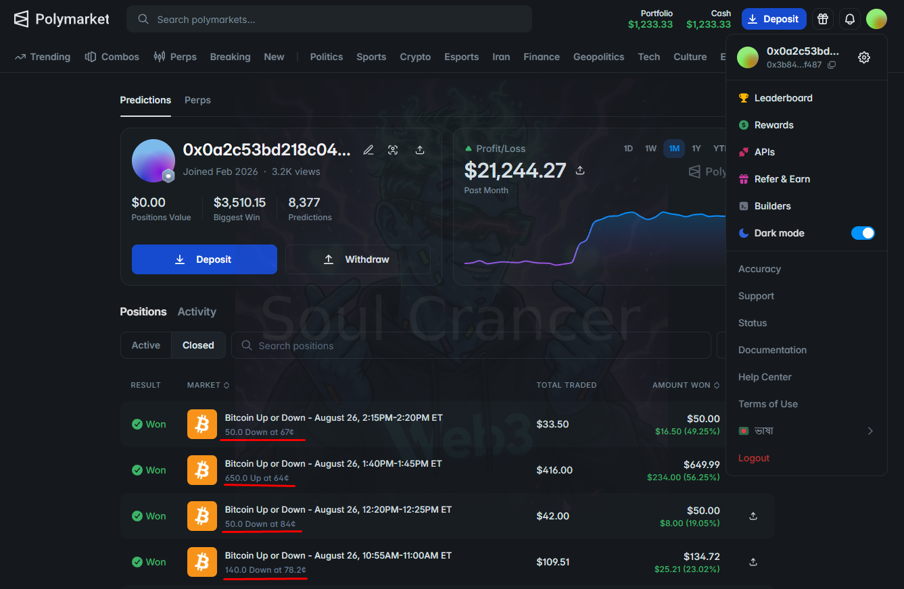
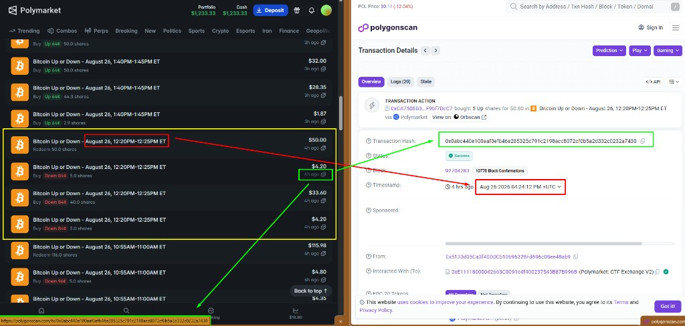

# Polymarket Trading Strategies

Systematic strategies running on the current **TWAP edition**. This document is a research journal: market condition, signal, entry, execution, edge, and risk — not a software manual.

`Polymarket` · `Algorithmic Trading` · `Quantitative Strategies` · `TWAP Edition`

Questions or support:

---

## Strategy Philosophy

Polymarket is not only about predicting the outcome. Short-window markets have **microstructure**: liquidity, timing, order-book lag, and brief dislocations around shocks and cycle boundaries.

These strategies trade **observable market behavior**, not a narrative view on Bitcoin. A condition has to be present in price, book, and remaining time before size is taken.

---

## Strategy Overview

| Strategy | Core Idea | Market Condition | Status |
| --- | --- | --- | --- |
| EndCycle Sniping | Buy the late-cycle favorite while it still trades below $1 | Short-window market near expiry; one side dominating | Live |
| Momentum Spike Sniping / Arbitrage | Hit a sudden dislocation after a sharp expansion | Fast repricing in a short BTC Up/Down window | Live |
| Additional strategies | Documented as they are introduced | — | Planned |

Live profiles are linked in each section. Displayed account figures are UI snapshots, not a verified track record.

---

## EndCycle Sniping (Not the Same Edge Anymore)

Polymarket profile: [0x3b84…f487](https://polymarket.com/0x3b8407699e832891203387d52c64d8f61ff2f487)

### The Idea

In 5-minute Bitcoin Up or Down markets, uncertainty compresses as the clock runs out. One side often becomes the favorite while still quoting below $1.

Near expiry, two things tend to change together: **time decay** concentrates probability on one outcome, and **liquidity quality** often deteriorates — thinner size, slower quote updates, a book that has not fully caught the remaining window.

The trade is not “predict Bitcoin.” It is: late in the cycle, is the favorite still cheap relative to remaining time and available size? The strategy tries to capture that last gap to settlement, if the read and the fill both hold.

### How the Trade Works

1. Monitor the active short-cycle market as it approaches the end of its window.
2. Read which outcome is dominating, where it is priced, and how much size is actually there.
3. Require that remaining time, price, and liquidity still justify a fill.
4. Buy the favored side.
5. Hold through resolution and redeem if the market settles in-the-money.

### Visual Example

**Example:** Closed 5-minute Bitcoin Up or Down positions on the EndCycle account (August 26).

- Every visible market is a 5-minute BTC Up/Down window — not a long-horizon prediction.
- Entries sit in the **64¢–84¢** range: favorite-side prices, not deep longshots.
- Size is not uniform (`$33.50` vs `$416.00`), consistent with liquidity- and condition-dependent execution rather than a fixed ticket.
- Each shown position redeemed near **$1 per share** after a win. That is settlement, not a claimed win rate.

**Example:** Same 12:20–12:25 PM ET window, mapped from the activity feed to the on-chain fill time.

- The feed shows **Buy Down at 84¢** (50 shares total) and a later **Redeem $50.00**.
- The annotated explorer timestamp is **04:24:12 UTC**, which is **12:24:12 PM ET**.
- The window closes at **12:25 PM ET** — this fill sits in the **final minute** of the cycle.
- That is the end-cycle setup in one frame: late clock, high price, small remaining gap to $1.

### Where the Edge Comes From

Binary short-horizon markets reprice as time expires. Probability mass concentrates on one outcome, but the book can still quote that side below 100¢. The potential edge is that last gap — an **execution and timing** problem as much as a directional one. If the favorite is already fully priced, or the fill is late, there is nothing left to capture.

### Risk

- The favorite can reverse in the last seconds of the window.
- Late-cycle books are often thin: slippage, partial fills, stale quotes.
- A correct read that is executed too late is just a bad fill.
- Wrong-side selection if the underlying print disagrees with the book.

---

## Momentum Spike Sniping / Arbitrage (Popular — Available for Sale)

Polymarket profile: [KARIZMATIKU](https://polymarket.com/0x85fc9f25299cafb649700d9034dda5a48f408700)

### The Idea

A **momentum spike** is a sudden expansion (or collapse) in one outcome’s price inside a short window. The move can outrun the resting book: one leg prints too cheap, the other too rich, or both legs gap to prices that no longer look internally consistent.

The sequence is:

**momentum → repricing → temporary dislocation → execution**

**Momentum** is the detection of that expansion. **Arbitrage-like execution** is hitting the dislocated leg(s) before the book catches up. This is not a locked, risk-free pair trade unless both legs are acquired such that payoff covers cost — and the examples below do not establish that. Buying the cheap side of a spike is still inventory risk if the move fades or the other leg is the one that settles at $1.

### How the Trade Works

1. Detect a sharp, short-horizon expansion in a BTC Up/Down market.
2. Measure how far the printed price has disconnected from the rest of the book and from the other leg.
3. Decide whether the remaining window still allows a useful fill.
4. Accumulate the dislocated side; if the other leg also prints at a depressed price, it may be hit as a second pass — that is not an automatic hedge.
5. Redeem the winning shares at settlement.

### Visual Example

**Example:** Closed short-window BTC Up/Down trades on the momentum account (August 25).

- Windows are 5–15 minutes (`5:00–5:15 PM`, `5:10–5:15 PM`, `5:55–6:00 AM`). Overlapping clocks are visible, not a single daily bet.
- Average entries are far below the EndCycle cluster: **20¢**, **44.4¢**, **48.6¢**, **54.7¢** — cheap-side inventory, not late favorites.
- The `5:00–5:15 PM` line shows **524.9 Up at 20¢**, `$105.09` traded, redeemed at `$524.92`. That average matches a spike-buy, not an 80¢ end-cycle snipe.
- Large percentage marks on winning rows describe settlement vs. cost basis on those lines. They are not a strategy-level return.

**Example:** Fill tape for the same `August 25, 5:00–5:15 PM ET` market.

- **Up accumulation:** 121.6 shares at **41¢**, then 403.4 shares at **12¢**. The spike continued; the second clip is cheaper than the first.
- **Down prints in the same window:** 177.0 at **28¢** and 259.8 at **10¢**. The book offered both legs at depressed prices at different points in the cycle.
- **Redeem 524.9 shares for $524.95** — $1 per share on the Up inventory (121.6 + 403.4). That confirms Up settled as the winner.
- Down inventory in this tape is a separate fill stream. If Up settles at $1, those Down shares do not. Hitting both cheap legs is **dislocation capture**, not a proven risk-free arb.

### Where the Edge Comes From

A fast move can leave resting quotes behind. One outcome can trade at 12¢ while the window is still open and the underlying has already moved. The potential inefficiency is that **lag between spike and book** — plus, occasionally, a second leg that also prints too cheap. The edge, if any, is getting filled inside that gap. Once the book has repriced, the setup is gone.

### Risk

- The spike can reverse; cheap inventory can expire at 0.
- Opposite-leg fills are extra risk unless they are a true pair with cost below payoff.
- Thin books during a spike: incomplete fills, slippage, chasing a print that has already moved.
- Overlapping 5- and 15-minute windows can correlate; several clips can fail together.
- Signal error: volatility is not the same thing as a tradable dislocation.

---

## More Strategies Coming

These are the strategies being introduced publicly.

Additional strategies are running in the broader TWAP system and will be documented the same way: condition, signal, execution, edge, risk — with live-market examples.

- Strategy 03 — Coming soon
- Strategy 04 — Coming soon
- Strategy 05 — Coming soon

---

## What These Strategies Have in Common

- React to **market structure**, not a story about the event.
- Require a **specific condition** (late clock, or a spike dislocation) before entry.
- Treat **execution** as part of the strategy: time remaining, size on the book, fill quality.
- Separate **signal** from **trade** — seeing a move is not the same as having a fill.
- Look for **repeatable behavior** in short-cycle BTC Up/Down markets, not isolated wins.

---

## Educational Takeaway

Systematic trading here is less about calling every market correctly and more about finding **repeatable conditions** where timing, liquidity, and payoff can produce a favorable expected outcome — and where they cannot.

Useful things to study on Polymarket short-cycle markets:

- Price path inside the window, not just the final result
- Liquidity and apparent order-book depth at the moment of the signal
- Time remaining versus how far the quote still sits from $0 or $1
- Whether both legs still add up in a way that makes sense
- Fill quality: average price, size received, delay to click or send
- Position-level risk: what the tape costs if the other side settles

Screenshots show **one path** through a market. They do not show the trades that did not work.

---

## Disclaimer

This README is educational and research material. It describes how these strategies think about Polymarket microstructure. It is not an offer, a performance record, or advice to trade.

Historical or displayed trades do not imply future results. Prediction-market trading involves risk, including full loss of capital. Market rules, resolution, liquidity, and fees should be verified independently before any trading decision.

---

## Contact

Questions or support:

- **Telegram** — [@soulcrancerdev](https://t.me/soulcrancerdev)
- **X** — [@soulcrancerdev](https://x.com/soulcrancerdev)
- **YouTube** — [@soulcrancerdev](https://youtube.com/@soulcrancerdev)
